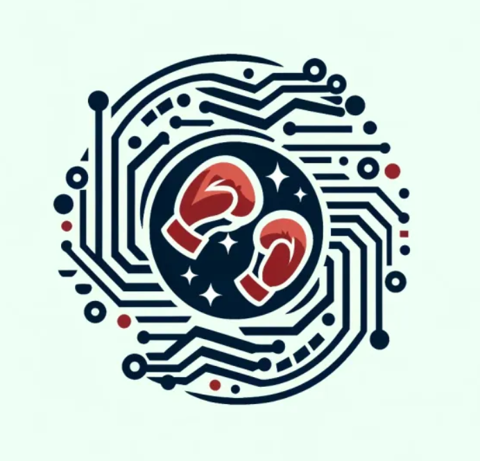
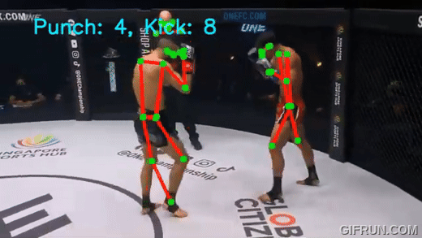
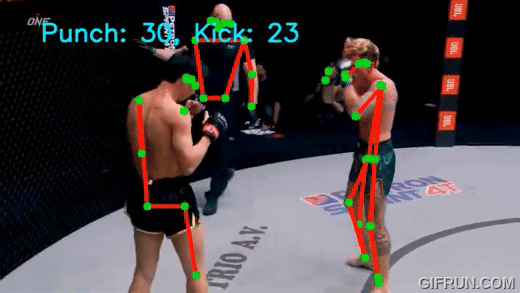

<!-- Improved compatibility of back to top link: See: https://github.com/othneildrew/Best-README-Template/pull/73 -->
<a name="readme-top"></a>
<!--
*** Thanks for checking out the Best-README-Template. If you have a suggestion
*** that would make this better, please fork the repo and create a pull request
*** or simply open an issue with the tag "enhancement".
*** Don't forget to give the project a star!
*** Thanks again! Now go create something AMAZING! :D
-->


<!-- PROJECT SHIELDS -->
<!--
*** I'm using markdown "reference style" links for readability.
*** Reference links are enclosed in brackets [ ] instead of parentheses ( ).
*** See the bottom of this document for the declaration of the reference variables
*** for contributors-url, forks-url, etc. This is an optional, concise syntax you may use.
*** https://www.markdownguide.org/basic-syntax/#reference-style-links
-->

<div align="center">

[![Contributors][contributors-shield]][contributors-url]
[![Forks][forks-shield]][forks-url]
[![Stargazers][stars-shield]][stars-url]
[![Issues][issues-shield]][issues-url]
[![MIT License][license-shield]][license-url]
[![LinkedIn][linkedin-shield]][linkedin-url]

<!-- PROJECT LOGO -->
<br />
  <a href="https://github.com/github_username/repo_name">
    
  </a>

<h1 align="center">StrikeMetrics</h1>

  <p align="center">
    StrikeMetrics is a prototype tool for combat sport analysis that utilizes elements of Computer Vision and Machine Learning. 
    <br />
    <a href="https://github.com/sswhitehat/StrikeMetrics---FinalProjectCS482"><strong>Explore the docs »</strong></a>
    <br />
    <br />
    <a href="https://github.com/sswhitehat/StrikeMetrics---FinalProjectCS482">View Demo</a>
    ·
    <a href="https://github.com/sswhitehat/StrikeMetrics---FinalProjectCS482/issues/new?labels=bug&template=bug-report---.md">Report Bug</a>
    ·
    <a href="https://github.com/sswhitehat/StrikeMetrics---FinalProjectCS482/issues/new?labels=enhancement&template=feature-request---.md">Request Feature</a>
  </p>
</div>

<!-- VIDEO AND GIF SECTION -->
## Videos and Demonstrations

Here are some videos and GIFs that demonstrate the project:

<div align="center">

### YouTube Videos
  
  [](https://www.youtube.com/watch?v=0cK-5Odirgo)
  [](https://www.youtube.com/watch?v=0yUIstA3iCI)
  [](https://www.youtube.com/watch?v=g-tiUbL8vpw)

### GIF Demonstrations
  
  
  
  
</div>

<p align="right">(<a href="#readme-top">Back to Top</a>)</p>


<!-- TABLE OF CONTENTS -->
<details>
  <summary>Table of Contents</summary>
  <ol>
    <li>
      <a href="#about-the-project">About The Project</a>
      <ul>
        <li><a href="#built-with">Built With</a></li>
      </ul>
    </li>
    <li>
      <a href="#getting-started">Getting Started</a>
      <ul>
        <li><a href="#prerequisites">Prerequisites</a></li>
        <li><a href="#installation">Installation</a></li>
      </ul>
    </li>
    <li><a href="#usage">Usage</a></li>
    <li><a href="#roadmap">Roadmap</a></li>
    <li><a href="#contributing">Contributing</a></li>
    <li><a href="#license">License</a></li>
    <li><a href="#contact">Contact</a></li>
    <li><a href="#acknowledgments">Acknowledgments</a></li>
  </ol>
</details>

## Problem
Many sports, like football, swimming etc, utilize computer vision approaches to enhance the appeal of the sport and make life easier for referees and officials. However, currently, in boxing, a referee has to manually count the punches and kicks (for kickboxing) to calculate the final score for the match. My group wanted to see if there is a way to automate the process by using a computer vision approach. 

Our initial plan was to create an application that would be able to detect the different kinds of punches and kicks thrown in a kickboxing match. The plan was to be able to detect different kinds of punches, like jabs, hooks, crosses and upper-cuts, and different kinds of kick, like leg, body and high kicks. We could then use this data to tally up the final score of the match. However, we encountered many challenges along the way.

Our approach was to use a nueral network model to predict punches and kicks. First, we collected a few different videos that would make up our training data. Next, we did two steps of pre-processing on the videos. First, we ran the MoveNet algorithm on the video to determine the fighters' keypoints which we would use as the input for our nueral network. Secondly, we annotated the frames with the correct punch type, ie. jab, hook, high kick, etc. We used CVAT to simplify this process. After collecting the pre-processed data, we constructed a LSTM model using the keypoints as our input and the annotated labels as the output. Next, we trained the model on our five different videos as our training dataset. Finally, we ran the model on a couple of different videos to test the accuracy.

Challenges that we faced:

* Different people annotated the video, so there could be different interpretations of what is a jab vs a hook, especially since some of the group members aren't the most experienced in boxing.
* Different videos had slight difference in camera angles which affected how MoveNet detected keypoints.
* Camera would pan around player at times causing one player to be behind another making it harder for MoveNet to detect both players.
* Running MoveNet on videos took a long time.
* Annotating the training data would take extensive manual labor.

## Challenges

<!-- ABOUT THE PROJECT -->
## About The Project

[![Product Name Screen Shot][product-screenshot]](https://example.com)

### Built With

* [![MoveNet][MoveNet.js]][MoveNet-url]
* [![PyTorch][PyTorch.js]][PyTorch-url]
* [![NumPy][NumPy.js]][NumPy-url]
* [![OpenCV][OpenCV.js]][OpenCV-url]
* [![Next][Next.js]][Next-url]
* [![React][React.js]][React-url]
* [![Vue][Vue.js]][Vue-url]
* [![Angular][Angular.io]][Angular-url]
* [![Svelte][Svelte.dev]][Svelte-url]
* [![Laravel][Laravel.com]][Laravel-url]
* [![Bootstrap][Bootstrap.com]][Bootstrap-url]
* [![JQuery][JQuery.com]][JQuery-url]

<p align="right">(<a href="#readme-top">Back to Top</a>)</p>

<!-- GETTING STARTED -->
## Getting Started

To set up a local copy of the project, follow these simple example steps.

### Prerequisites

This project requires Python and several Python libraries. Before you begin, ensure you have Python installed on your system. If not, you can download it from [Python](https://www.python.org/downloads/) (Version 3.8+ is recommended). You will also need to install the required Python libraries which are listed in the requirements.txt file after cloning the repository.

### Installation

Follow these instructions to get your development environment running:

1. Clone the repo
   ```sh
   git clone https://github.com/sswhitehat/StrikeMetrics---FinalProjectCS482.git
   ```
2. Navigate to the project directory:
   ```sh
   cd StrikeMetrics---FinalProjectCS482
   ```
3. Download Required Libraries
   ```sh
   pip install -r requirements.txt
   ```

<p align="right">(<a href="#readme-top">Back to Top</a>)</p>


<!-- USAGE EXAMPLES -->
## Usage

Use this space to show useful examples of how a project can be used. Additional screenshots, code examples and demos work well in this space. You may also link to more resources.

_For more examples, please refer to the [Documentation](https://example.com)_

<!-- ROADMAP -->
## Roadmap

- [ ] Feature 1
- [ ] Feature 2
- [ ] Feature 3
    - [ ] Nested Feature

See the [open issues](https://github.com/sswhitehat/StrikeMetrics---FinalProjectCS482/issues) for a full list of proposed features (and known issues).

<p align="right">(<a href="#readme-top">Back to Top</a>)</p>


<!-- CONTRIBUTING -->
## Contributing

Contributions are what make the open source community such an amazing place to learn, inspire, and create. Any contributions you make are **greatly appreciated**.

If you have a suggestion that would make this better, please fork the repo and create a pull request. You can also simply open an issue with the tag "enhancement".
Don't forget to give the project a star! Thanks again!

1. Fork the Project
2. Create your Feature Branch (`git checkout -b feature/AmazingFeature`)
3. Commit your Changes (`git commit -m 'Add some AmazingFeature'`)
4. Push to the Branch (`git push origin feature/AmazingFeature`)
5. Open a Pull Request

<p align="right">(<a href="#readme-top">Back to Top</a>)</p>

<!-- LICENSE -->
## License

Distributed under the MIT License. See `LICENSE.txt` for more information.

<!-- CONTACT -->
## Contact

Your Name - [@twitter_handle](https://twitter.com/twitter_handle) - email@email_client.com

Project Link: [https://github.com/sswhitehat/StrikeMetrics---FinalProjectCS482](https://github.com/sswhitehat/StrikeMetrics---FinalProjectCS482)

<!-- ACKNOWLEDGMENTS -->
## Acknowledgments

* []()
* []()
* []()

<p align="right">(<a href="#readme-top">Back to Top</a>)</p>

<!-- MARKDOWN LINKS & IMAGES -->
<!-- https://www.markdownguide.org/basic-syntax/#reference-style-links -->
[contributors-shield]: https://img.shields.io/github/contributors/sswhitehat/StrikeMetrics---FinalProjectCS482.svg?style=for-the-badge
[contributors-url]: https://github.com/sswhitehat/StrikeMetrics---FinalProjectCS482/graphs/contributors
[forks-shield]: https://img.shields.io/github/forks/sswhitehat/StrikeMetrics---FinalProjectCS482.svg?style=for-the-badge
[forks-url]: https://github.com/sswhitehat/StrikeMetrics---FinalProjectCS482/network/members
[stars-shield]: https://img.shields.io/github/stars/sswhitehat/StrikeMetrics---FinalProjectCS482.svg?style=for-the-badge
[stars-url]: https://github.com/sswhitehat/StrikeMetrics---FinalProjectCS482/stargazers
[issues-shield]: https://img.shields.io/github/issues/sswhitehat/StrikeMetrics---FinalProjectCS482.svg?style=for-the-badge
[issues-url]: https://github.com/sswhitehat/StrikeMetrics---FinalProjectCS482/issues
[license-shield]: https://img.shields.io/github/license/sswhitehat/StrikeMetrics---FinalProjectCS482.svg?style=for-the-badge
[license-url]: https://github.com/sswhitehat/StrikeMetrics---FinalProjectCS482/blob/master/LICENSE.txt
[linkedin-shield]: https://img.shields.io/badge/-LinkedIn-black.svg?style=for-the-badge&logo=linkedin&colorB=555
[linkedin-url]: https://linkedin.com/in/linkedin_username
[backtotop-shield]: https://img.shields.io/badge/Back_to_Top-373B3B?style=for-the-badge
[product-screenshot]: images/screenshot.png
[MoveNet.js]: https://img.shields.io/badge/MoveNet-FFDDB3?style=for-the-badge&logo=tensorflow&logoColor=FC6A3F
[MoveNet-url]: https://blog.tensorflow.org/2021/05/next-generation-pose-detection-with-movenet-and-tensorflowjs.html
[PyTorch.js]: https://img.shields.io/badge/PyTorch-66736C?style=for-the-badge&logo=pytorch&logoColor=FC6A3F
[PyTorch-url]: https://pytorch.org/
[NumPy.js]: https://img.shields.io/badge/NumPy-5581E0?style=for-the-badge&logo=numpy&logoColor=9DD4FF
[NumPy-url]: https://numpy.org/
[OpenCV.js]: https://img.shields.io/badge/OpenCV-FFFDFC?style=for-the-badge&logo=opencv&logoColor=FF3E00
[OpenCV-url]: https://opencv.org/
[Next.js]: https://img.shields.io/badge/next.js-000000?style=for-the-badge&logo=nextdotjs&logoColor=white
[Next-url]: https://nextjs.org/
[React.js]: https://img.shields.io/badge/React-20232A?style=for-the-badge&logo=react&logoColor=61DAFB
[React-url]: https://reactjs.org/
[Vue.js]: https://img.shields.io/badge/Vue.js-35495E?style=for-the-badge&logo=vuedotjs&logoColor=4FC08D
[Vue-url]: https://vuejs.org/
[Angular.io]: https://img.shields.io/badge/Angular-DD0031?style=for-the-badge&logo=angular&logoColor=white
[Angular-url]: https://angular.io/
[Svelte.dev]: https://img.shields.io/badge/Svelte-4A4A55?style=for-the-badge&logo=svelte&logoColor=FF3E00
[Svelte-url]: https://svelte.dev/
[Laravel.com]: https://img.shields.io/badge/Laravel-FF2D20?style=for-the-badge&logo=laravel&logoColor=white
[Laravel-url]: https://laravel.com
[Bootstrap.com]: https://img.shields.io/badge/Bootstrap-563D7C?style=for-the-badge&logo=bootstrap&logoColor=white
[Bootstrap-url]: https://getbootstrap.com
[JQuery.com]: https://img.shields.io/badge/jQuery-0769AD?style=for-the-badge&logo=jquery&logoColor=white
[JQuery-url]: https://jquery.com 
[JQuery.com]: https://img.shields.io/badge/jQuery-0769AD?style=for-the-badge&logo=jquery&logoColor=white
[JQuery-url]: https://jquery.com 
